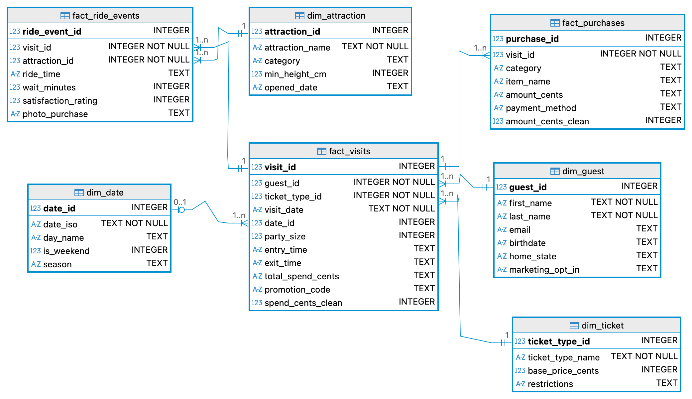

# Module 3 Final Project - Supernova Theme Park Analytics

<p align=center>
An exploratory analysis project for the theme park Supernova, which has been experiencing uneven guest satisfaction scores in recent months. Issues such as long wait times, inconsistent ride availability, and overcrowding are among the biggest factors contributing to poor satisfaction scores. With a goal of aligning operational efficiency, guest experience, and targeted marketing strategies throughout all departments of the park, this project aims to explore the nuances of park dissatisfaction and recommendations to improve these issues.
</p>


## Project Overview

#### Project Analyst

**Rolando Mancilla-Rojas** - Project Director & Data Analyst

  - [LinkedIn](https://www.linkedin.com/in/rolandoma33/)
  - [GitHub](https://github.com/ro-the-creator)

#### Primary Stakeholder
- Dylon Husk - Park General Manager

#### Supporting Stakeholders
- Cleff Heyzoz - Operations Director for Staffing & Queues
- Darren Muffett - Marketing Director for Promotions & Ticket Mix

### Business Problem

<p align=center>
Supernova theme park has been facing uneven guest satisfaction scores and fluctuating revenue streams over the past two quarters, and seeks to understand why on a deeper, technical level. Supernova leadership aims to develop a cross-departmental plan for the next quarter, with hopes to strategically align operational efficiency, guest experience, and targeted marketing strategies to improve guest satisfaction scores and maximize revenue.
</p>

<br>

## Repo Navigation

1. [Database Management](#Database)
   - [Schema](#Schema)
   - [Wire Dimension](#Wire-Dimension)
2. [SQL Cleaning & Analysis](#SQL)
   - [Cleaning](#Cleaning)
     - [CTEs & Windows](#CTEs-&-Windows)
     - [Feature Engineering](#Feature-Engineering)
   - [EDA](#EDA)
3. [Visualizations in Python](#Python)
   - [Visualizations](#Visualizations)
4. [Findings & Recommendations](#Findings)
   - [Insights & Recommendations](#Insights-&-Recommendations)
   - [Ethics & Biases](#Ethics-&-Biases)
5. [Closing Regards](#Closing=Regards)

## Database

<p align=center>
Familiarizing myself with the database is a crucial part of working with the dataset. Mapping out the Primary/Foreign keys, column types, and whether NULLs are allowed were all information that I had to collect to effectively perform exploratory data analysis.
</p>

### Schema

<p align=center>
This database has a Star Schema.
</p>

<p align=center>
A star schema is a database model that categorizes data into two types, fact and dimension, for the purpose of distinctly defining collected data using reference tables. Simply, the dimension tables provide context and purpose to the data displayed in the fact tables.
</p>
 


<p align=center>
In the diagram above, the dimensional tables provide referential information to the factual tables, which represent the real numbers collected for the themepark, Supernova. Listed below are the primary and foreign keys:
</p>

<br>

<div align="center">
  
| Column Name | Primary Key Table | Foreign Key Table |
|:-----------:|:-----------:|:-----------:|
|attraction_id|dim_attraction|fact_ride_events|
|visit_id|fact_visits|fact_ride_events|
|visit_id|fact_visits|fact_purchases|
|date_id|dim_date|fact_visits|
|guest_id|dim_guest|fact_visits|
|ticket_type_id|dim_ticket|fact_visits|
|ride_event_id|fact_ride_event|None|
|purchase_id|fact_purchases|None|
</div>

<br>

<div align="center">

A full chart detailing all column information can be found [here](https://docs.google.com/document/d/1ldzzX7_WIHPKrLzqj0FB3MBSfXIyRWftGnNW3i5hCOQ/edit?usp=sharing).
</div>

<br>

### Benefits to Star Schema

<p align=center>
There are several benefits to star schemas, especially in the context of the Supernova Theme Park. Some key benefits include:
</p>

1. Star schemas help keep the data organized and separated by using dimension tables that provide key identifiers for the fact tables. In this data, for example, the dim_guest table provides unique identifier columns for each guest_id, which is then used as a foreign key for the factual, recorded data.

2. The other columns within the dimension columns help with grouping data for aggregation. Dim_attraction, for example, has the attraction’s category that can be grouped to do statistical analysis for each attraction category.

3. Star schemas prevent repetition through normalization. Rather than having the same columns across multiple tables, separating this unique identifying data into dimension tables helps with clarity and computing cost.


### Wire Dimension

<p align=center>
To gain better insight into the dates provided in the fact_visits table, creating a new dimensional table must be done. This new table, dim_dates, provides information like the day of the week, the season, and whether or not it is a weekend day. Although subtle, this information will aid greatly in aggregating data for deeper analysis later.
</p>

<p align=center> We set up a new primary key, date_id, that can be used to join tables with fact_visits easily. The ID is simply the full date from the fact_visits table, which can easily be converted using the following function:
</p> 

<div align="center">
  
```ruby
STRFTIME('%Y%m%d', visit_date)
```
</div>

## SQL

### Cleaning

#### CTEs & Windows

#### Feature Engineering

### EDA


## Python

### Visualizations


## Findings

### Insights & Recommendations

### Ethics & Biases


## Closing Regards
