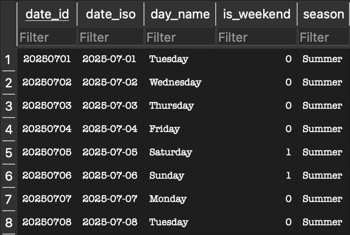
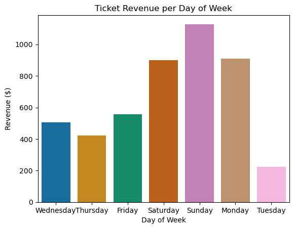
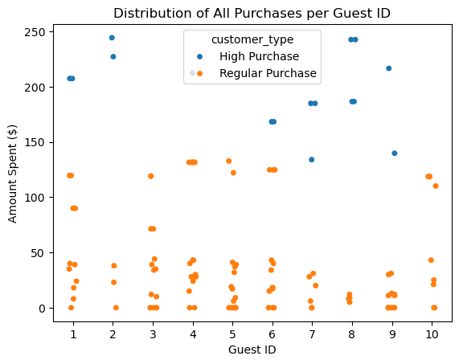
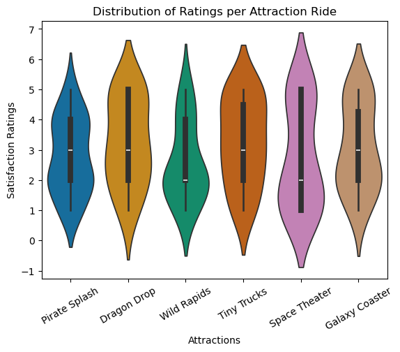

# Module 3 Final Project - Supernova Theme Park Analytics

<p align=center>
An exploratory analysis project for the theme park Supernova, which has been experiencing uneven guest satisfaction scores in recent months. Issues such as long wait times, inconsistent ride availability, and overcrowding are among the biggest factors contributing to poor satisfaction scores. With a goal of aligning operational efficiency, guest experience, and targeted marketing strategies throughout all departments of the park, this project aims to explore the nuances of park dissatisfaction and recommendations to improve these issues.
</p>


## Project Overview

#### Project Analyst

**Rolando Mancilla-Rojas** - Project Director & Data Analyst

  - [LinkedIn](https://www.linkedin.com/in/rolandoma33/)
  - [GitHub](https://github.com/ro-the-creator)

#### Primary Stakeholder
- Dylon Husk - Park General Manager

#### Supporting Stakeholders
- Cleff Heyzoz - Operations Director for Staffing & Queues
- Darren Muffett - Marketing Director for Promotions & Ticket Mix

### Business Problem

<p align=center>
Supernova theme park has been facing uneven guest satisfaction scores and fluctuating revenue streams over the past two quarters, and seeks to understand why on a deeper, technical level. Supernova leadership aims to develop a cross-departmental plan for the next quarter, with hopes to strategically align operational efficiency, guest experience, and targeted marketing strategies to improve guest satisfaction scores and maximize revenue.
</p>

<br>

## Repo Navigation

1. [Database Management](#Database-Management)
   - [Schema](#Schema)
     - [Benefits to Schema](#Benefits-to-Star-Schema)
   - [Wire Dimension](#Wire-Dimension)
2. [SQL Cleaning & Analysis](#SQL-Cleaning-&-Analysis)
   - [Cleaning](#Cleaning)
     - [Feature Engineering](#Feature-Engineering)
     - [CTEs & Windows](#CTEs-&-Windows)
3. [Visualizations in Python](#Python)
   - [Visualizations](#Visualizations)
4. [Findings & Recommendations](#Findings)
   - [Insights & Recommendations](#Insights-&-Recommendations)
   - [Ethics & Biases](#Ethics-&-Biases)

## Database Management

<p align=center>
Familiarizing myself with the database is a crucial part of working with the dataset. Mapping out the Primary/Foreign keys, column types, and whether NULLs are allowed were all information that I had to collect to effectively perform exploratory data analysis.
</p>

### Schema

<p align=center>
This database has a Star Schema.
</p>

<p align=center>
A star schema is a database model that categorizes data into two types, fact and dimension, for the purpose of distinctly defining collected data using reference tables. Simply, the dimension tables provide context and purpose to the data displayed in the fact tables.
</p>
 


<p align=center>
In the diagram above, the dimensional tables provide referential information to the factual tables, which represent the real numbers collected for the themepark, Supernova. Listed below are the primary and foreign keys:
</p>

<br>

<div align="center">
  
| Column Name | Primary Key Table | Foreign Key Table |
|:-----------:|:-----------:|:-----------:|
|attraction_id|dim_attraction|fact_ride_events|
|visit_id|fact_visits|fact_ride_events|
|visit_id|fact_visits|fact_purchases|
|date_id|dim_date|fact_visits|
|guest_id|dim_guest|fact_visits|
|ticket_type_id|dim_ticket|fact_visits|
|ride_event_id|fact_ride_event|None|
|purchase_id|fact_purchases|None|
</div>

<br>

<div align="center">

A full chart detailing all column information can be found [here](https://docs.google.com/document/d/1ldzzX7_WIHPKrLzqj0FB3MBSfXIyRWftGnNW3i5hCOQ/edit?usp=sharing).
</div>

<br>

### Benefits to Star Schema

<p align=center>
There are several benefits to star schemas, especially in the context of the Supernova Theme Park. Some key benefits include:
</p>

1. Star schemas help keep the data organized and separated by using dimension tables that provide key identifiers for the fact tables. In this data, for example, the dim_guest table provides unique identifier columns for each guest_id, which is then used as a foreign key for the factual, recorded data.

2. The other columns within the dimension columns help with grouping data for aggregation. Dim_attraction, for example, has the attraction’s category that can be grouped to do statistical analysis for each attraction category.

3. Star schemas prevent repetition through normalization. Rather than having the same columns across multiple tables, separating this unique identifying data into dimension tables helps with clarity and computing cost.


### Wire Dimension

<p align=center>
To gain better insight into the dates provided in the fact_visits table, creating a new dimensional table must be done. This new table, dim_dates, provides information like the day of the week, the season, and whether or not it is a weekend day. Although subtle, this information will aid greatly in aggregating data for deeper analysis later.
</p>

<p align=center> We set up a new primary key, date_id, that can be used to join tables with fact_visits easily. The ID is simply the full date from the fact_visits table, which can easily be converted using the following function:
</p> 

<div align="center">
  
```ruby
STRFTIME('%Y%m%d', visit_date)
```
</div>

<br>

<div align=center>


</div>

<p align=center>
In the end, we get a simple yet effective table.
</p>

## SQL Cleaning & Analysis

### Cleaning

<p align=center>
The cleaning process for the theme park database included a plethora of actions. Overall, however, cleaning mainly consisted of creating new columns to preserve old data, validating keys, finding and dealing with duplicates, and filling in NULLs.
Below is a full list of cleaning actions:
</p>

**Cleaned columns across all tables**

- dim_attraction
  - attraction_names
    - Uppercased, trimmed, and removed punctuation marks
- dim_guest
  - home_state
    - Changed all to abbreviations, uppercased
  - marketing_opt_in
    - Uppercased, changed to one letter
- dim_ticket
  - base_price_cents
     -converted to dollars
- fact_visits
  - promotion_code
    - Uppercased, removed extra characters
  - total_spend_cents
    - trimmed, removed extra characters
- fact_purchases
  - amount_cents
    - trimmed, removed extra characters
  - payment_method
    - Trimmed and uppercased

**Something to Note:**
amount_cents and total_spend_cents were converted to dollars in new columns, where it was used in most EDA. (More Information in Feature Engineering)

<br>

<p align=center>
For validating keys, functions were run on the Primary and Foreign keys to find orphans.
</p>

<p align=center>
Validating keys means making sure there are no orphans in the data. An orphan relative to SQL is a foreign key row, known as the child, that does not match a primary key row, known as the parent. Parent rows can have no corresponding children row because it means that the data for that dimension has never been recorded, but a child row cannot have an unmatched parent row because all recorded data must correspond to an established dimension.
</p>

<p align=center>
To do this, a simple function is run (example on one set of keys):
</p> 

```c++
SELECT v.visit_id, v.guest_id
FROM fact_visits v
LEFT JOIN dim_guest g ON g.guest_id = v.guest_id
WHERE g.guest_id IS NULL;
```

<p align=center>
There were no orphans!
</p>

<br>

<p align=center>
For filling in NULLs, the following steps were done to fill them in:
</p>

- Filled in NULL rows in dim_guest: marketing_opt_in_clean with ‘N’. Assumption that NULL row means no.
- Filled in fact_purchases: amount_dollar with ‘Unknown’. Cannot deduct the price of the item from the current data. Need the data from those rows, can’t drop them.
- Filled in fact_ride_events: wait_minutes & photo_purchase.
- Filled wait_minutes with 0, assuming that null row means there was no wait time.
- Filled in photo_purchase with N for No, assuming no entry means no photo purchase.
- Filled in fact_visits: spend_dollar & promotion_code_clean
- Filled spend_dollar with ‘Unknown’, Cannot deduct price from ticket+promo.
- Filled promotion_code_clean with ‘None’. Assumption that no entry means no promo code.

<p align=center>
Overall, only two duplicate rows were dropped in dim_attractions.
</p>
  
#### Feature Engineering

<p align=center>
Feature engineering consists of creating new views from the existing columns in the tables, with the idea of gaining additional insight. For the new insights, I aimed to look into how long customers stay at the park, how much they spend on average, and how often they use promo codes:
</p>

1. Created stay_duration_minutes, which roughly calculates how many minutes the guests stayed at the park. This helps give a quick insight rather than to mentally calculate it by looking at entry_time and exit_time. 
    - Found that most people stay for 600 minutes (10 hours)
2. Created wait_buckets, which puts wait times under a specific timeframe category. This helps for grouping wait times for rides, which can give insight as to       which rides lines may be taking longer.
    - Found frequency of grouped wait buckets. Found that No Wait (0 mins), Very Long Wait (>45 mins), and Long Wait (31-45 mins) were the top three most   frequent occurrences.
    - Also found average wait times per bucket.
  
<div align="center">
  
|Wait Bucket|Average Wait Time|
|:--------------:|:--------:|
|No Wait|0.0|
|Short Wait|6.1|
|Medium Wait|24.11|
|Long Wait|36.07|
|Very Long Wait|65.39|

</div>

3. Finding out the average spend in dollars per customer, and categorizing them as Low, Regular, or High Spenders.
  - There were 3 Low, 4 Regular, and 3 Premium.
4. Frequency of promo code use, and the total revenue generated from in-park purchases when those promo codes are used. Good for checking if promo codes are   leading to profits
  - SUMMER25 promo code is generating revenue, total of $840.49.
  - VIPDAY has similar usage to no promo code, but generating significantly less revenue.

#### CTEs & Windows

<p align=center>
Using CTEs and Window functions was a vital part of the entire SQL coding process. CTEs helped with organizing the code and making it readable, as well as producing large, complicated queries in a digestible way.
</p> 

A documented list of the CTEs and Window Functions can be found [here](https://docs.google.com/document/d/1apobbUSqXWydtaSXdV5jplz4-c9q2QhUEAKyZ3diFIU/edit?usp=sharing).


## Python

### Visualizations

<p align=center>
The culmination of all the SQL coding finally led to producing visualizations in Python. Using sqlite3 and Pandas libraries, I was able to input queries into a notebook to produce Seaborn visuals.
</p>

<div align='center'>







</div>

## Findings

### Insights & Recommendations

<p align=center>
Based on my findings, I recommend to the stakeholders that there should be an emphasized focus on allocating resources for weekends, which is shown to be the most profitable days of the week.
</p>

<p align=center>
Furthermore, with the newly established high purchase category, marked at $133.94, a new target goal to convert customers' average total spending across tickets and in-park purchases can be prioritized.
</p>

<p align=center>
Finally, with the concern of low satisfaction scores, I recommend a greater focus on kids' rides, which seem to consistently get high satisfaction scores. While this alone from the figure seems like a big jump, it can also be supported by the spending delta vs. prior visits, which seems to show increased spending for larger parties. Larger parties at a theme park are likely families, meaning prioritizing kids rides can be an effective means to improve satisfaction scores and raise revenue.
</p>

### Ethics & Biases

<p align=center>
In cleaning, analyzing, and providing recommendations with this dataset, there were several decisions I had to make that introduced bias. While I strive to maintain an ethical, transparent approach to data analytics, I ran into certain issues that could not be fixed due to time constraints.
</p>

<p align=center>
The only major hinderance that could not be fixed with limited time was renumerating the attraction_id column in dim_attractions, which turned inconsistent due to dropping two duplicate rows. While I was able to reorient the attraction_id values that were dropped in the fact_ride_events table, I was unable to renumerate the original Primary Key in dim_attractions.
</p>

<p align=center>
Furthermore, certain cleaning decisions were made that were based on assumptions. For example, the NULL promotion code values were assumed to be no promo code input.
</p>


> [!NOTE]
>  This is a fictitious scenario created by the GitHub authors for academic purposes only.
